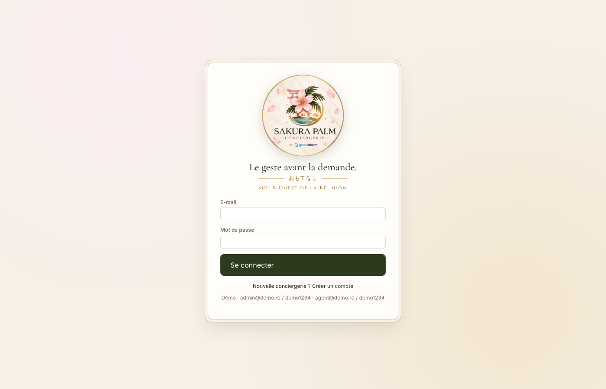
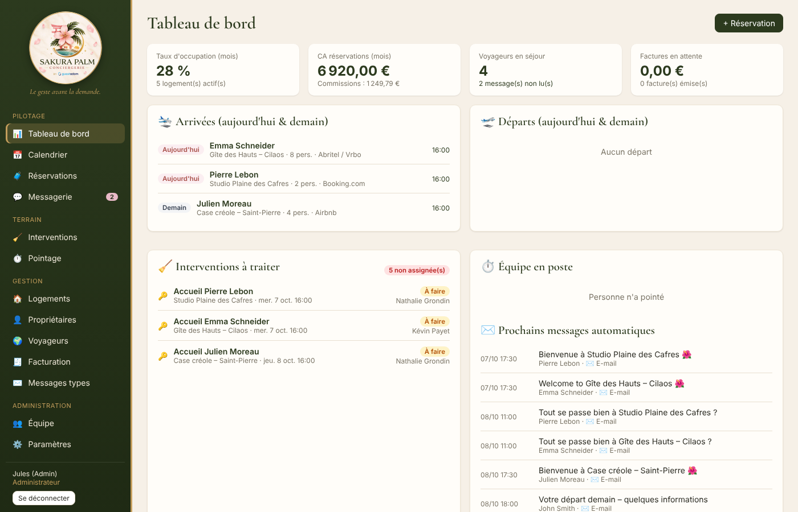
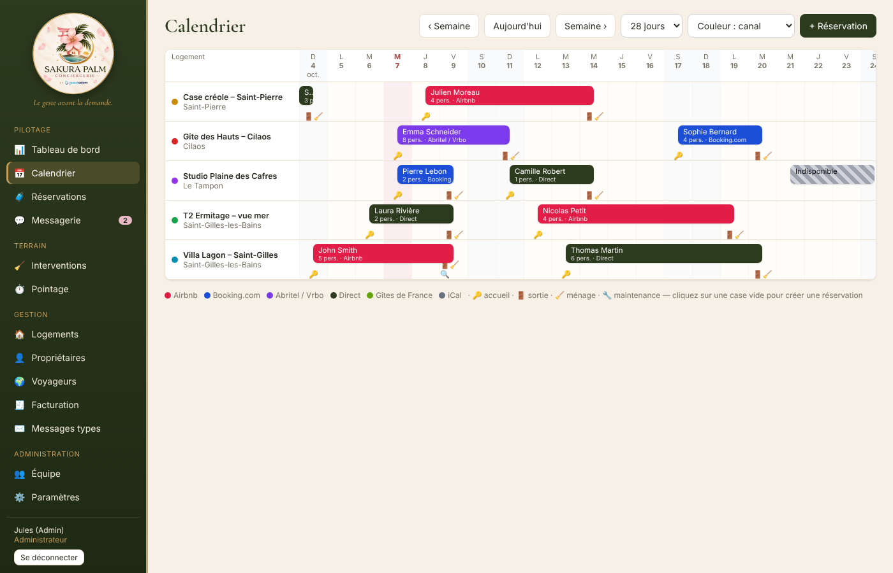
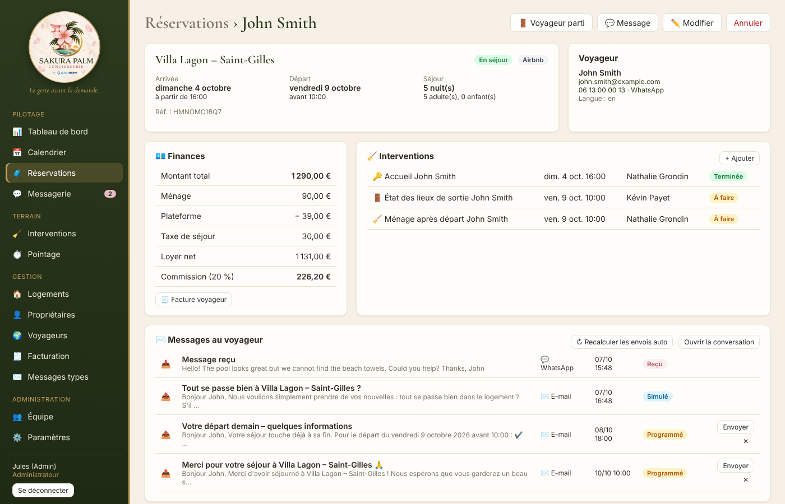
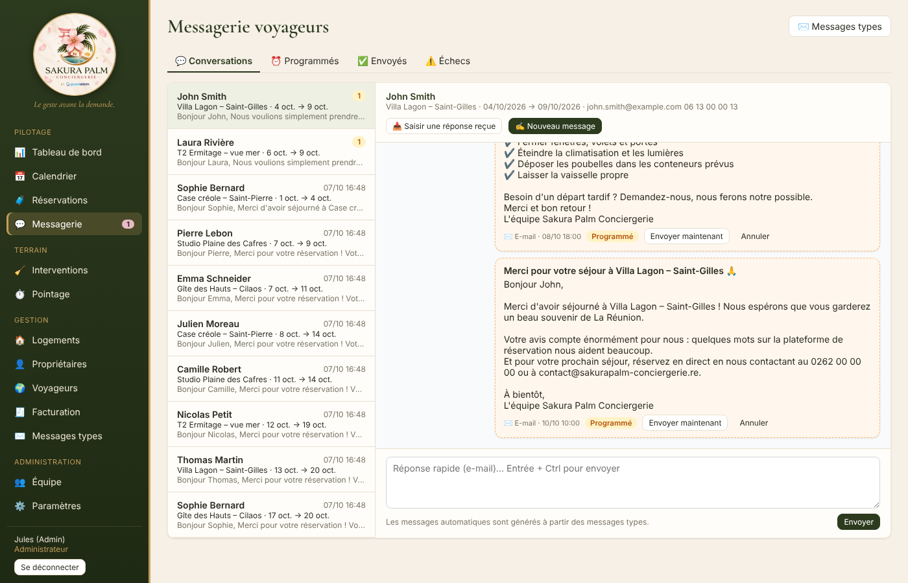
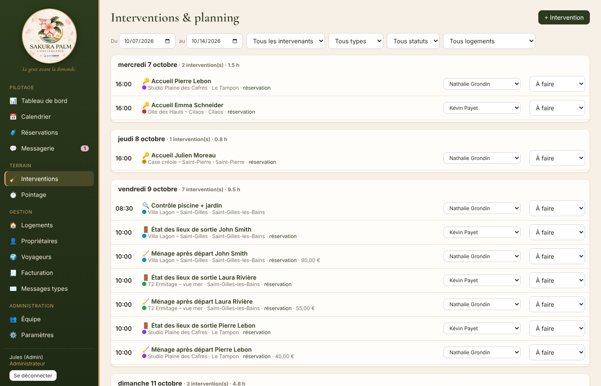
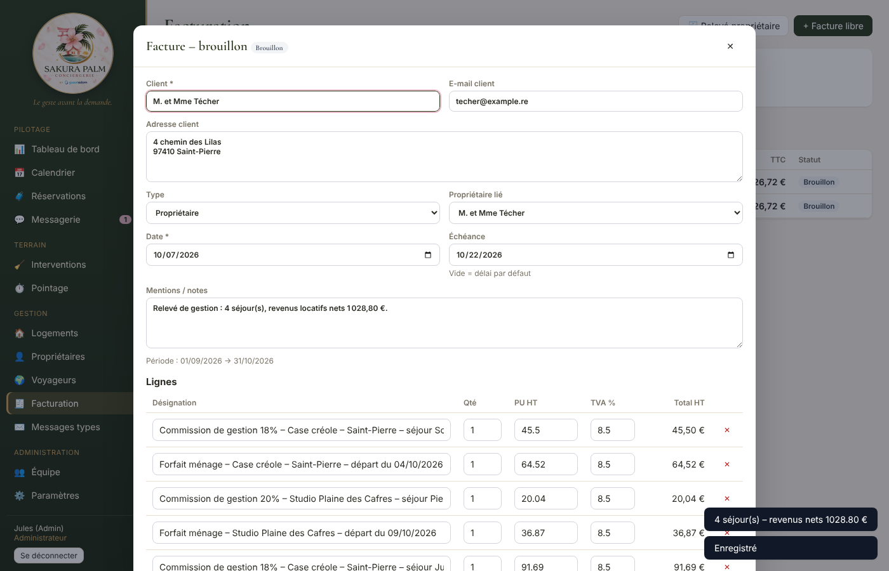
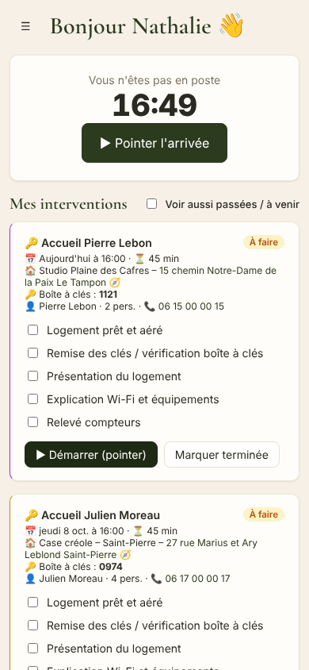
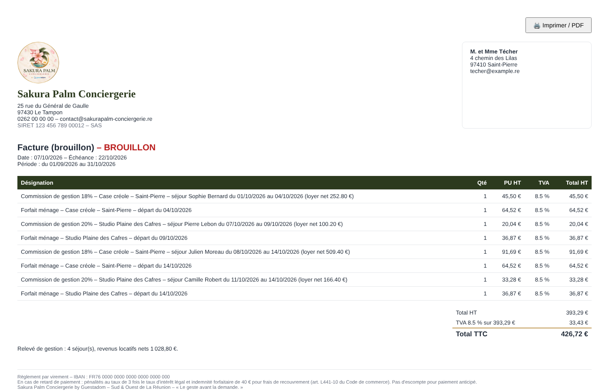

<p align="center"></p>

# Sakura Palm Conciergerie – SaaS de gestion de conciergerie

*« Le geste avant la demande. » – おもてなし – Sud & Ouest de La Réunion*

Application web complète pour piloter une conciergerie de locations saisonnières à La Réunion :
logements, calendrier, accueil des voyageurs, interventions terrain, pointage, facturation et
messagerie voyageurs avec messages automatiques.

Multi-conciergeries (chaque compte a son propre espace, totalement cloisonné), multi-utilisateurs
(administrateur, gestionnaire, agent de terrain), utilisable sur ordinateur et smartphone.





## Charte graphique

Logo et couleurs repris du visuel officiel (`docs/brand/sakura-palm-charte.png`). Le logo détouré
est dans `public/img/` (`logo.png` 512 px, `logo-256.png`, `emblem.png`, `favicon.png`).

| Couleur | Code | Usage |
|---|---|---|
| Vert palme | `#2C3A1E` | Titres, boutons, menu |
| Or | `#C49E5C` (foncé `#9E783E`) | Filets, cadres, accents |
| Rose sakura | `#E9B9C7` (clair `#FBEEF1`) | Badges, mises en avant, focus |
| Rose « Conciergerie » | `#A9504A` | Accents texte |
| Lagon | `#5FA090` | Couleur logement par défaut |
| Crème | `#F6F0E7` | Fond |

Polices : *Cormorant Garamond* (titres) et *Cinzel* (capitales), via Google Fonts.

## Fonctionnalités

| Module | Ce qu'il fait |
|---|---|
| **Tableau de bord** | Taux d'occupation du mois, CA, commissions, voyageurs en séjour, arrivées / départs du jour et du lendemain, interventions à traiter, équipe en poste, prochains messages automatiques |
| **Calendrier** | Planning multi-logements (14 à 60 jours), réservations colorées par canal (Airbnb, Booking, Abritel, direct…), blocages, icônes d'intervention (🔑 accueil, 🚪 sortie, 🧹 ménage). Clic sur une case vide = nouvelle réservation |
| **Réservations** | Fiche complète : voyageur, dates, montants (ménage, commission plateforme, taxe de séjour), loyer net et commission de gestion calculés, contrôle des chevauchements, statuts (confirmée → en séjour → terminée / annulée) |
| **Accueil & interventions** | À chaque réservation, création automatique de l'**accueil**, de l'**état des lieux de sortie** et du **ménage** (avec check-lists). Planning par jour, assignation aux agents, interventions manuelles (maintenance, linge, contrôle) refacturables au propriétaire |
| **Espace agent (mobile)** | L'agent voit ses missions du jour : adresse (lien GPS), code boîte à clés, voyageur, check-list, consignes. Bouton « Démarrer » (pointe l'arrivée) et « Terminer » (pointe la sortie + compte rendu) |
| **Pointage** | Pointage arrivée / sortie avec géolocalisation, chronomètre, saisie et correction manuelles, synthèse heures + coût par intervenant, export CSV pour la paie |
| **Messagerie voyageurs** | Conversations par réservation, réponse rapide, saisie des messages reçus (Airbnb, WhatsApp…), file des messages programmés, envoyés, en échec. Envoi par e-mail (SMTP), préparation SMS / WhatsApp (lien wa.me) |
| **Messages types** | Parcours automatique livré prêt à l'emploi : confirmation, instructions d'arrivée (J-2), bienvenue (jour J), « comment se passe le séjour ? » (J+1), préparation du départ (veille), remerciement + avis (après départ), version anglaise, relance heure d'arrivée, objet oublié. Variables `{{prenom}}`, `{{logement}}`, `{{code_boite}}`, `{{wifi_mdp}}`… avec aperçu |
| **Facturation** | Relevé mensuel propriétaire en un clic (commission sur loyer net, forfaits ménage, interventions refacturables), facture voyageur depuis une réservation, factures libres. Numérotation légale continue (`FA-2026-0001`), TVA DOM (8,5 % / 2,1 % / 0 %), mentions légales, impression PDF, envoi par e-mail, suivi payé / en retard |
| **iCal** | Import automatique (toutes les heures) des calendriers Airbnb / Booking / Abritel, et lien d'export iCal par logement pour bloquer les réservations directes sur les plateformes |
| **Équipe & paramètres** | Gestion des comptes et rôles, taux horaires, coordonnées et mentions de l'entreprise, TVA, numérotation, SMTP avec e-mail de test |

## Démarrage rapide

Prérequis : **Node.js 22.5 ou plus** (la base SQLite est intégrée à Node, rien d'autre à installer).

```bash
cd conciergerie
npm install
npm run seed     # optionnel : données de démonstration (5 logements à La Réunion)
npm start        # http://localhost:3000
```

Comptes de démonstration (mot de passe `demo1234`) :

- `admin@demo.re` – administrateur
- `manager@demo.re` – gestionnaire
- `agent@demo.re` / `agent2@demo.re` – agents de terrain (vue mobile)

Sans données de démo, cliquez sur **« Créer un compte »** : votre conciergerie est créée avec les
messages types par défaut.

## Configuration

Copiez `.env.example` en `.env` :

| Variable | Rôle |
|---|---|
| `PORT` | Port HTTP (3000 par défaut) |
| `DATABASE_FILE` | Fichier SQLite (`data/conciergerie.db`) |
| `COOKIE_SECURE` | `true` en production derrière HTTPS |
| `ALLOW_SIGNUP` | `false` pour fermer la création de nouveaux comptes |
| `SMTP_*` | Serveur e-mail global (sinon, chaque conciergerie le saisit dans **Paramètres**) |

**Envoi des e-mails** : sans SMTP, les messages sont enregistrés en mode « simulation » dans
l'historique (rien n'est envoyé). Avec Gmail / Google Workspace, utilisez `smtp.gmail.com`, port 587
et un *mot de passe d'application*.

## Mise en production

```bash
docker build -t sakura-palm-conciergerie .
docker run -d -p 3000:3000 -v sakura-data:/data -e COOKIE_SECURE=true sakura-palm-conciergerie
```

Placez l'application derrière un proxy HTTPS (Caddy, Nginx, ou un hébergeur type Render / Railway /
Fly.io / VPS OVH). Sauvegardez régulièrement le fichier SQLite (volume `/data`).

## Fonctionnement des automatisations

- **Création / modification d'une réservation** → interventions accueil, sortie, ménage créées ou
  déplacées ; messages automatiques (re)programmés selon les messages types actifs et la langue du
  voyageur. Un message dont l'heure est passée part immédiatement s'il est encore pertinent
  (pas de « bienvenue » une fois le voyageur parti).
- **Annulation** → messages programmés annulés, interventions « à faire » annulées.
- **Planificateur** (toutes les minutes) → envoi des messages arrivés à échéance ;
  (toutes les heures) → import des calendriers iCal.
- Les heures sont gérées dans le fuseau de la conciergerie (La Réunion, UTC+4 par défaut).

## Architecture

```
conciergerie/
├── src/
│   ├── server.js          démarrage + planificateur
│   ├── app.js             application Express (API + fichiers statiques + export iCal)
│   ├── db.js              schéma SQLite (node:sqlite)
│   ├── auth.js            mots de passe scrypt, sessions, rôles
│   ├── defaults.js        messages types par défaut
│   ├── seed.js            données de démonstration
│   ├── lib/               automatisations, facturation, iCal, e-mails, dates, modèles
│   └── routes/            API REST (réservations, opérations, messagerie, factures…)
├── public/                interface web (HTML/CSS/JS sans build)
└── test/                  tests (npm test)
```

API REST sous `/api` (authentification par cookie de session ou en-tête `Authorization: Bearer <token>`
renvoyé par `/api/auth/login`), ce qui permet de brancher une app mobile ou des outils externes.

## Pistes d'évolution

- Connecteurs SMS / WhatsApp Business (Twilio, Brevo) dans `src/lib/mailer.js`
- Paiement en ligne des factures (Stripe) et reversements propriétaires
- Portail propriétaire en lecture seule (calendrier + relevés)
- Photos de fin de ménage dans le compte rendu d'intervention
- Livret d'accueil numérique par logement

## Captures

| | |
|---|---|
|  |  |
|  |  |
|  |  |
|  | |
